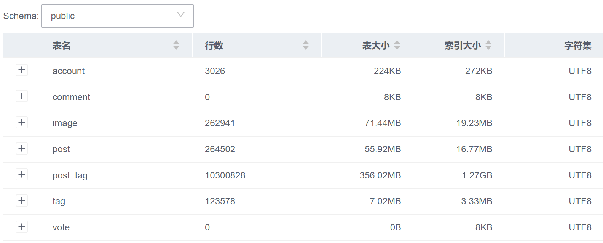

# Milestone 2 Report - WAKUWAKU 插画分享站

## 项目背景

在当今数字时代，二次元文化已经成为了全球范围内广受欢迎的文化现象。二次元插画是一种独特而富有创意的艺术形式，它通过可爱、夸张和富有表现力的角色形象，吸引了大量的追随者和创作者。也诞生出众多供爱好者们交流、分享和欣赏二次元插画的平台。

这些插画平台如 Pixiv、Danbooru 等通常都具有完善的标签系统，可以帮助用户快速地找到自己感兴趣的图片，也可以帮助网站管理和分类图片。标签可以分为很多种类，比如作者、来源、角色等等。通过组合不同的标签，用户可以实现精确和灵活的搜索功能。

最近一年，本来只是为了方便用户搜索的标签系统又在大模型领域发挥了更大的作用，各种 Text to Image 模型的出现，让用户可以通过输入自然语言，生成自己想要的图片。而网站的标签系统，天然就是一个庞大的训练数据集。如基于 Stable Diffusion 的应用最广泛的微调模型 NovelAI，其训练数据就来自插画网站 Danbooru 的标签系统。

本项目旨在设计一个方便广大二次元爱好者交流、分享和欣赏二次元插画的平台，支持用户上传自己的作品，为作品打分，标注各种详细的标签，并通过组合不同的标签和筛选条件完成个性化的插画搜索。我们参考了一些已有的二次元插画图片站，比如 Pixiv、Danbooru 等，学习了它们的设计思路和技术实现，并结合我们自己的想法和需求，设计了这个项目。

## milestone2 包含内容

6. Choose an appropriate platform for your application;
7. A cquire the large “production” dataset;
8. Test the SQL statements you developed for Task 5 in the large database;
9. Implement and debug the application and the web interface;

## 6. Choose an appropriate platform for your application;

我们选择的平台是Flask和Vue.js，Flask是一个基于Python的轻量级Web应用框架，Vue.js是一个构建数据驱动的web界面的渐进式框架，我们将使用Flask作为后端框架，Vue.js作为前端框架，实现一个基于Web的二次元插画分享站。

## 7. Acquire the large “production” dataset;

这是目前的数据库内的数据，目前有26w张的图片，全部使用爬虫抓取得来。


## 8. Test the SQL statements you developed for Task 5 in the large database;

数据库查询所需要的SQL语句是由sqlalchemy自动生成的，我们只需要在前端传入对应的参数即可，下面是一个例子：

我们要对一个tag进行搜索，这是我们的后端api：

```python
from wakuwaku.api import bp
from wakuwaku.models import Tag

from flask import request, jsonify

@bp.route("/autocomplete", methods=["GET"])
def autocomplete():
    """Autocomplete tags.

    This endpoint allows users to autocomplete tags.
    
    ---
    tags:
        - tags
    parameters:
        -   name: q
            in: query
            type: string
            required: true
            description: The query string.
    responses:
        200:
            description: Tags found.
            schema:
                type: object
                properties:
                    tags:
                        type: array
                        items:
                            $ref: "#/definitions/Tag"
        400:
            description: Invalid parameters
            schema:
                type: object
                properties:
                    message:
                        type: string
                        description: An error message.
                        example: invalid parameters
    """
    try:
        q = request.args.get("q")
    except KeyError:
        return jsonify({"message": "invalid parameters"}), 400
    
    # 按照tag.count排序，最多返回10个tag
    tags = Tag.query.filter(Tag.name.like(f"%{q}%")).order_by(Tag.count.desc()).limit(10).all()
    tags = [tag.to_dict() for tag in tags]
    return jsonify({"tags": tags}), 200
```

这是SQLalchemy生成的SQL语句：

```sql
SELECT tag.tag_id AS tag_tag_id, tag.type AS tag_type, tag.name AS tag_name, tag.count AS tag_count
FROM tag
WHERE tag.name LIKE %(name_1)s ORDER BY tag.count DESC
LIMIT %(param_1)s
```

经过测试没有什么问题

## 9. Implement and debug the application and the web interface;

### 目前完成的功能：

后端代码见repository内的wakuwaku文件夹

<!-- fcy在这里展示一下每个功能前端的界面即可 -->

#### 用户登录：

后端对应接口在user.py内

#### 查看图片：

后端对应接口在posts.py内

#### 上传图片：

后端对应接口在upload.py内

#### 根据tag搜索图片：

后端对应接口在tag.py内

#### 为图片评价：

后端对应接口在vote.py内

